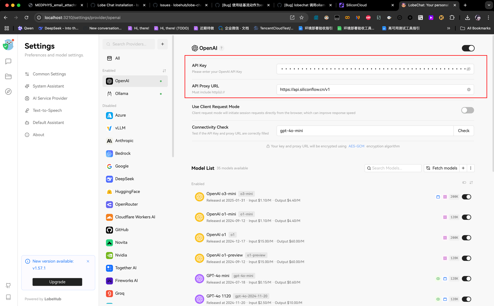

# Lobe Chat

> Ref: <https://github.com/lobehub/lobe-chat>
> NOTE: Currently only support localhost deployment. Might support remote deployment in the future.

## Re-Deploy Lobe Chat with docker compose

注意：重新安装时，只需要删掉lobe-chat容器，然后拉取最新lobe-chat容器，执行`docker compose up -d`。不要删除`docker-compose.yml`和`init_data.json`，也不要删除`data`和`s3_data`。否则之前的数据就丢失了。代码是否拉取最新的无所谓。因为使用的并不是最新代码提供的docker compose文件，而是本地的。

```bash
docker rm -f lobe-chat
docker pull lobehub/lobe-chat-database:latest
docker compose up -d  # Or: docker-compose up -d
```

## First deploy Lobe Chat with docker compose

```text
Based on: https://github.com/lobehub/lobe-chat
Branch: main
Commit: efb9311e6f3c
```

```bash
pwd
# /Users/yusongli/Documents

git clone git@github.com:ysl2/lobe-chat.git
cd lobe-chat/docker-compose/local
bash setup.sh
# Select the second option: Port mode

autossh -M 37004 -NfR 47.xxx.xxx.227:38004:localhost:36004 -p 36000 yusongli@47.xxx.xxx.227
autossh -M 37005 -NfR 47.xxx.xxx.227:38005:localhost:36005 -p 36000 yusongli@47.xxx.xxx.227
autossh -M 37006 -NfR 47.xxx.xxx.227:38006:localhost:36006 -p 36000 yusongli@47.xxx.xxx.227
autossh -M 37007 -NfR 47.xxx.xxx.227:38007:localhost:36007 -p 36000 yusongli@47.xxx.xxx.227
autossh -M 37008 -NfR 47.xxx.xxx.227:38008:localhost:36008 -p 36000 yusongli@47.xxx.xxx.227

docker compose up -d
```

## Embedding model configuration

把这里换成siliconflow的key和proxy，用于embedding模型



关键的`.env`配置如下:

```bash
# DEFAULT_FILES_CONFIG=embedding_model=siliconcloud/Pro/BAAI/bge-m3
DEFAULT_FILES_CONFIG=embedding_model=siliconcloud/Qwen/Qwen3-Embedding-0.6B
```

PS: 413是因为该模型不支持1024维，换了BAAI后正常。

> Ref: 刚刚去看了代码实现，代码实现是通过从`$DEFAULT_FILES_CONFIG` 截取 PROVIDER 来组合提取env中存在的`${PROVIDER}_API_KEY`,`${PROVIDER}_PROXY_URL` 来构建对应的请求的，如果没有`${PROVIDER}_API_KEY`会使用`$OPENAI_API_KEY`来兜底，兜底这个行为本身需要斟酌，因为可能导致没有正确配置的环境把openai的key暴露到不匹配的provider，但是代码逻辑本身没有问题。
> 最后我使用相同环境下重新部署了一次，没有再次复现这个问题。
